# Password Policy State-Space Lab

Exact combinatorics and one application-level uniform-rank selection for
constrained password policies. Instead of assembling required characters and
shuffling—or retrying until a candidate happens to pass—the lab counts the
complete valid state space, assigns every member one stable rank, and samples
that rank uniformly.

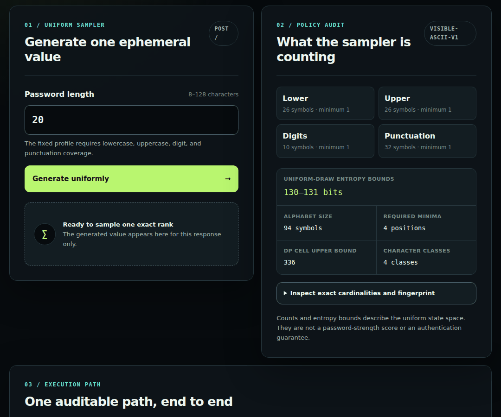

> This is a real loopback Waitress session, not a mockup. The capture visits the
> live GET page, submits an invalid length to the real Flask handler, and records
> its `400` response. A process-local guard makes the evidence build fail if the
> sampler is called, so no password is generated or placed in repository media.

## What makes the core auditable

| Guarantee | Mechanism | Review surface |
|---|---|---|
| Exact policy cardinality | bounded bottom-up dynamic programming with arbitrary-precision integers | CLI JSON/CSV and the web audit panel |
| Uniform sampling | exactly one `secrets.randbelow(total)` followed by deterministic `unrank` | source-derived sampling diagram and rank-selection call tests |
| Complete reversible ordering | tested `rank`/`unrank` bijection over every valid string | exhaustive small-space Cartesian oracles |
| Bounded failure | malformed, impossible, or excessive policies fail before enumeration | policy, request, and budget tests |
| Reproducible evidence | deterministic raw outputs, source hashes, browser assertions, and artifact digests | `docs/evidence/manifest.json` |

Ranks are deterministic inspection tools, not credentials to reuse. A rank is a
reversible encoding of its candidate under one exact ordered policy.

## Setup and verify

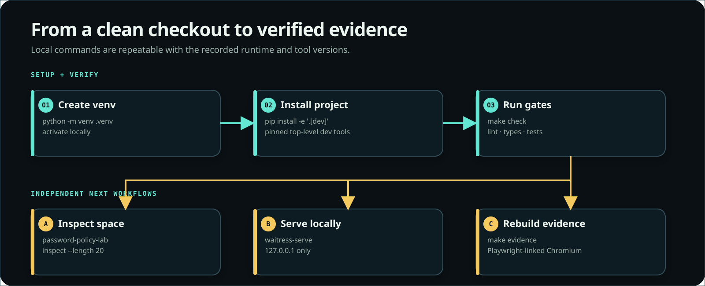

```bash
python3 -m venv .venv
source .venv/bin/activate
python -m pip install -e '.[dev]'
make check
```

The package supports Python 3.11 or newer. `make check` runs Ruff, formatting,
strict mypy, exhaustive and independent mathematical oracles, real Flask
request tests, 100% combined line/branch coverage, the distribution
attestation, and the committed-evidence integrity check.

Start the pinned production WSGI server on loopback:

```bash
waitress-serve \
  --host 127.0.0.1 \
  --port 5000 \
  --max-request-body-size=1024 \
  --max-request-header-size=16384 \
  --channel-timeout=30 \
  --call password_policy_lab.web:create_app
```

Then open `http://127.0.0.1:5000`.

## Reproducible distribution contract

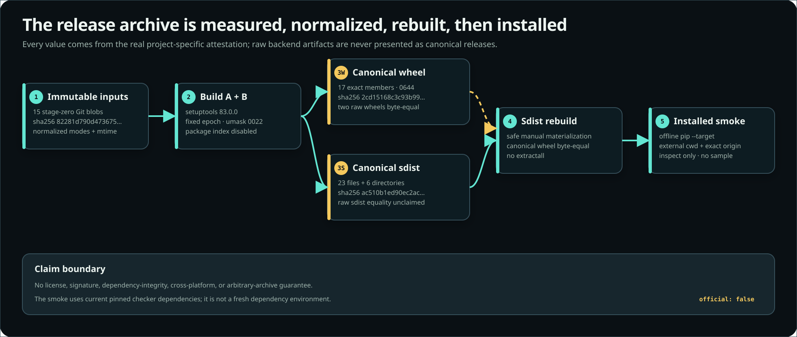

`make distribution-check` does not trust the migrated worktree's file modes or
an implicit setuptools file list. It snapshots exactly 15 stage-zero Git blobs,
materializes two normalized source trees, builds both with the pinned
`setuptools==83.0.0`, and validates exact archive inventories:

- the wheel has 17 regular members with fixed ZIP metadata and a complete,
  canonical `RECORD`;
- the sdist has 23 regular files and six directories, with fixed modes, epoch,
  owner fields, member order, and gzip header;
- a wheel rebuilt from the safely materialized canonical sdist is byte-for-byte
  equal to the canonicalized wheel produced by each primary build;
- an offline `pip --target` install from an external working directory imports
  package code and metadata from that target, finds both package resources, and
  runs deterministic `inspect --length 20 --format json` twice without sampling.

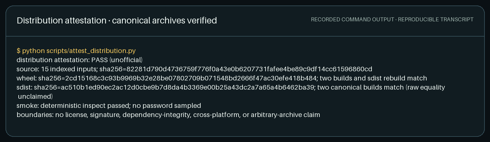

Run the attested path with:

```bash
make distribution-check
```

The raw [`distribution-check.txt`](docs/evidence/distribution-check.txt) and
canonical
[`distribution-attestation.json`](docs/evidence/distribution-attestation.json)
record the input digest, complete member-level SHA-256 inventory, canonical
archive hashes, rebuild equality, toolchain, smoke result, and negative claim
boundaries. `make build` remains a conventional backend build for local
inspection; its raw sdist contains environment-dependent metadata and is not
presented as the canonical release artifact.

The attestation is deliberately unofficial. It does not claim a license,
artifact signature, dependency integrity, cross-platform reproducibility, or
safety for arbitrary archives. The install smoke uses the current pinned
checker dependencies without resolving them; it is not a fresh, hash-locked
dependency environment.

## Architecture

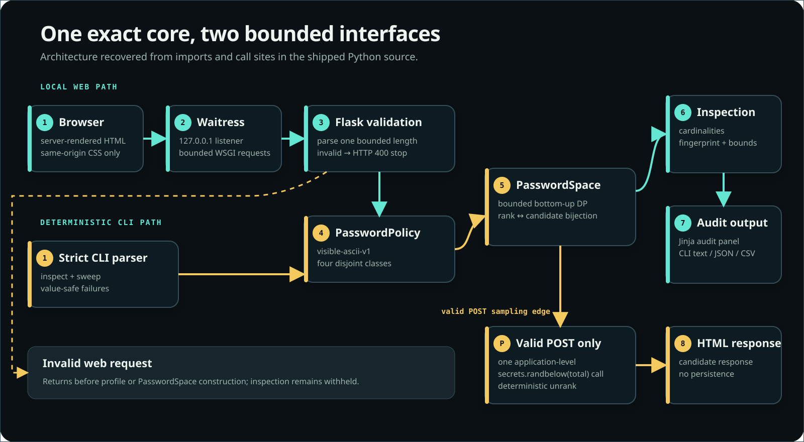

The browser and CLI share the same versioned visible-ASCII policy, exact
`PasswordSpace`, and inspection model. The web route constructs one space,
derives the displayed metrics from that same object, and then performs one
sample. Invalid requests stop before policy construction. The CLI inspection
path is deterministic and consumes no entropy.

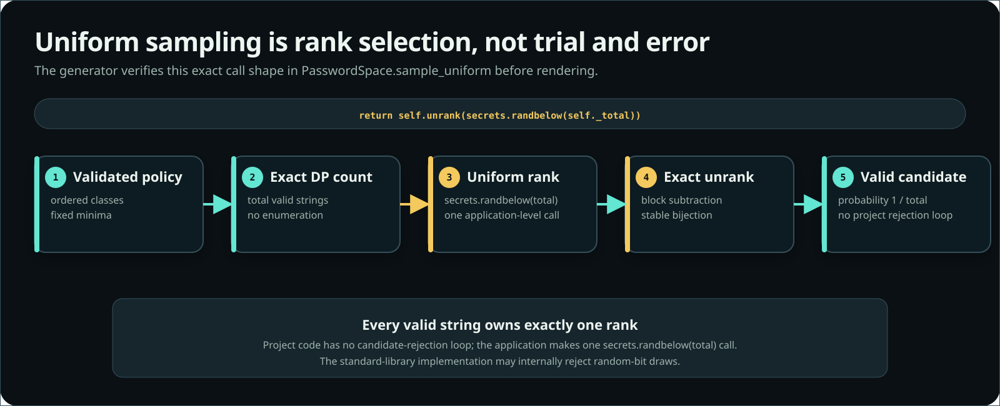

The sampling diagram is checked against the current syntax tree: the production
path selects an integer with `secrets.randbelow(total)` and passes it directly
to `unrank`. Project code has no modulo reduction, candidate-rejection loop, or
use of the `random` module. (`secrets.randbelow` may perform its own internal
random-bit rejection sampling.)

## Exact state-space evidence

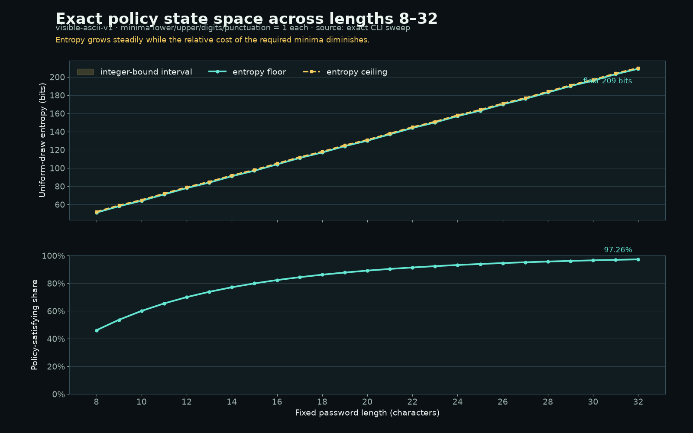

The figure is rendered from the committed
[`state-space-sweep.csv`](docs/evidence/state-space-sweep.csv), produced by the
real CLI for lengths 8–32. It pairs exact entropy bounds with the
policy-satisfying share on an honest 0–100% scale. Counts and entropy describe a
uniform draw from this state space; they are not a password-strength score or an
authentication guarantee.

## Differential dynamic-programming work evidence

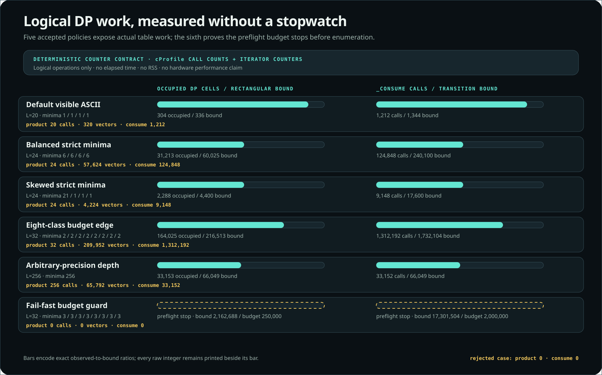

The profiler constructs the real `PasswordSpace` under six fixed public
policies and retains only deterministic logical counters. A context-managed
iterator wrapper counts every deficit vector yielded to the production loop;
`cProfile` independently records exact `_build_layers` and `_consume` call
counts. Separate polynomial-convolution and class-population oracles must agree
with layer occupancy and the final arbitrary-precision state-space total.

The controlled comparison keeps length `24`, the same four class widths, and
the same total minimum `24`: balanced minima `(6, 6, 6, 6)` materialize
`31,213` cells and perform `124,848` transitions, while skewed minima
`(21, 1, 1, 1)` materialize `2,288` cells and perform `9,148` transitions.
This isolates the shape of the deficit state space instead of presenting a
wall-clock benchmark.

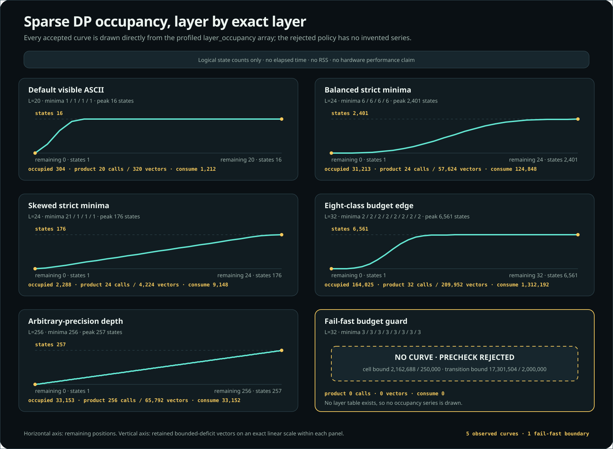

The near-budget eight-class case is accepted at `164,025 / 216,513` cells and
`1,312,192 / 1,732,104` transitions. Raising every minimum from `2` to `3`
pushes the conservative bounds to `2,162,688` cells and `17,301,504`
transitions; profiling observes zero product, layer-build, and consume calls
because rejection happens before enumeration. The maximum-length one-class
case remains accepted and reaches a `1,678`-bit count. That bit length describes
integer arithmetic magnitude, not allocated memory.

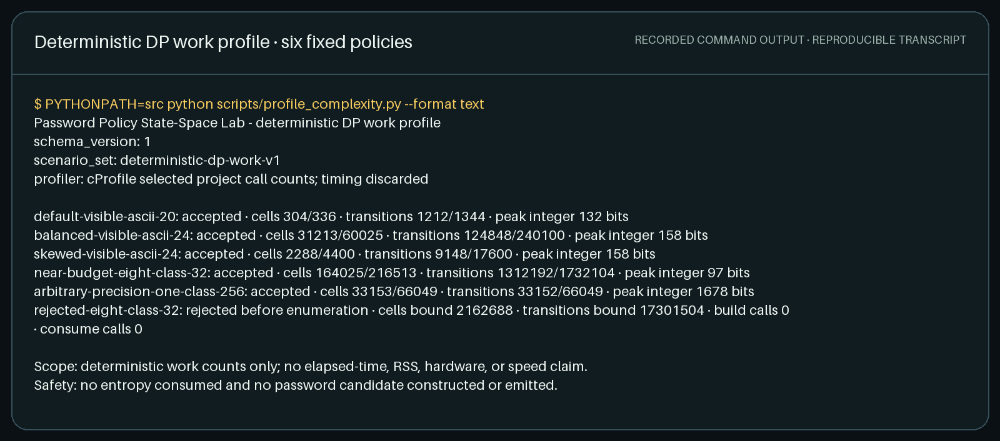

Run the concise profile with `make complexity-profile`. The complete
[canonical JSON receipt](docs/evidence/dp-complexity-profile.json) retains every
accepted layer, while the
[real command transcript](docs/evidence/dp-complexity-profile.txt) stays short
enough to review. The evidence makes no elapsed-time, throughput, RSS,
allocation, CPU, hardware, password-strength, or cross-machine performance
claim. It consumes no entropy and constructs or emits no password candidate.

## Deterministic audit CLI

The inspection commands never sample a password. They emit exact decimal
integers, a reduced satisfying fraction, rank interval, integer entropy bounds,
bounded-DP limits, and a SHA-256 fingerprint of the complete ordered policy.
Arbitrary-size JSON values remain strings so JavaScript readers cannot silently
round them.

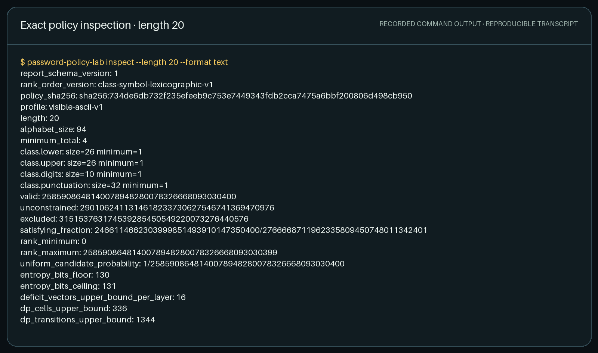

```bash
password-policy-lab inspect --length 20 --format json
password-policy-lab sweep \
  --start-length 8 \
  --end-length 32 \
  --format csv
```

The raw, machine-reviewable counterpart is
[`cli-inspect.txt`](docs/evidence/cli-inspect.txt). Outputs contain no
timestamps, machine paths, locale-dependent formatting, or randomness.

`rank` and `unrank` exist only for public deterministic test vectors. Both
require `--acknowledge-reversible-output`; `rank` accepts its candidate only
through bounded standard input or hidden terminal input, never an argument.
Do not use either command with a credential.

## Local web interface

<table>
  <tr>
    <td width="67%">
      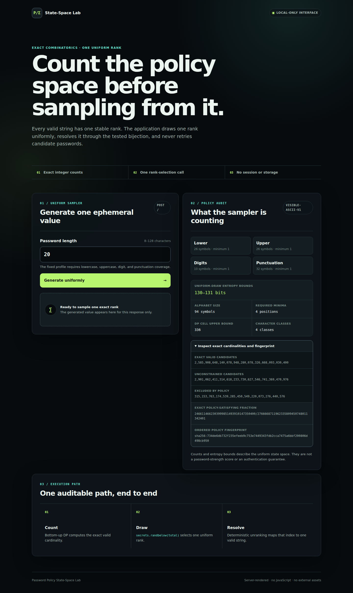
    </td>
    <td width="33%">
      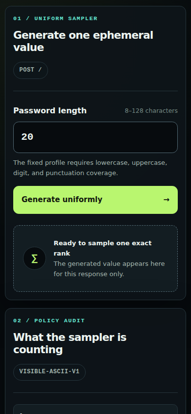
    </td>
  </tr>
  <tr>
    <td><strong>Desktop:</strong> exact metrics and uniform-sampler workflow.</td>
    <td><strong>Mobile:</strong> the same semantic flow without horizontal overflow.</td>
  </tr>
</table>

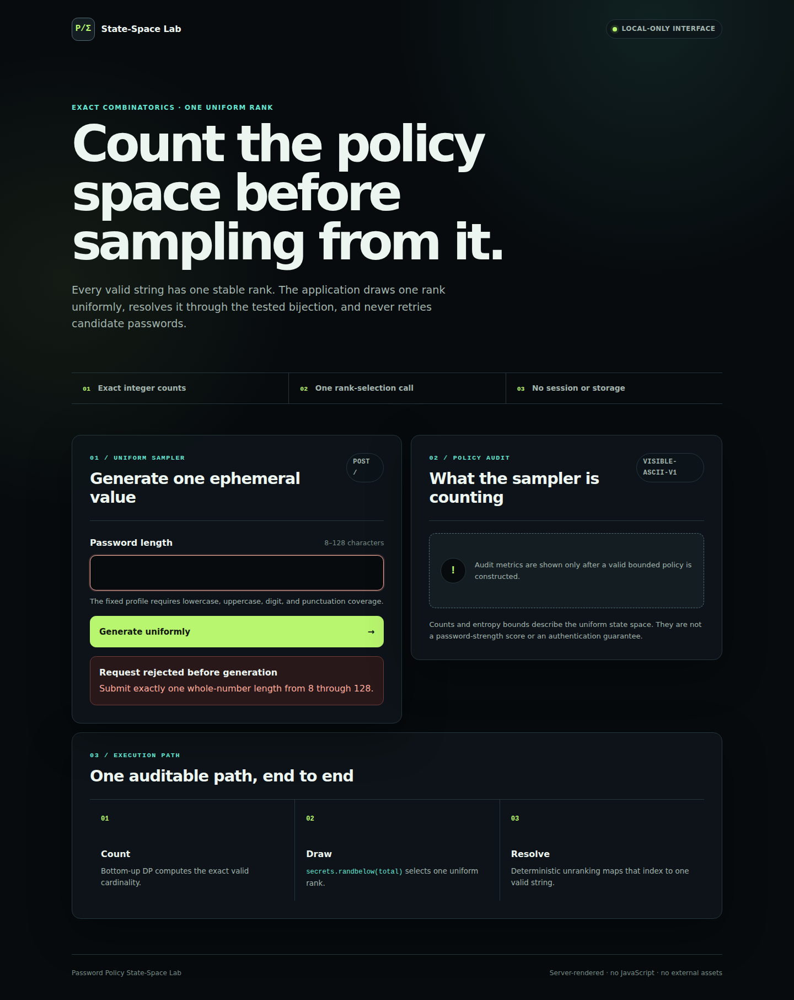

The form accepts lengths from 8 through 128. Every generated value satisfies
the fixed lowercase, uppercase, digit, and ASCII-punctuation minima. The
interface is entirely server-rendered: one package-local stylesheet, no
JavaScript, CDN, web font, external request, cookie, session, or storage.

The documented Waitress command binds only to loopback; the Flask application
trusts only loopback host names. With that command, Flask and Waitress both
enforce the 1 KiB request-body boundary. Responses are non-cacheable and carry
a restrictive CSP, origin isolation, frame denial, no-referrer, and
MIME-sniffing protections. The current endpoint has no server-side mutation,
session, or authenticated identity, so it has no CSRF token; adding any of
those features requires revisiting that decision.

The server does not log or retain a generated value, but Python, the browser,
and the clipboard cannot promise memory zeroization. Run the app as an
unprivileged user, and do not change the bind address without transport
security and a deliberate deployment boundary.

These choices follow the official
[Flask security guidance](https://flask.palletsprojects.com/en/stable/web-security/)
and
[deployment guidance](https://flask.palletsprojects.com/en/stable/deploying/).

## Security reporting and repository controls

Report suspected vulnerabilities through the
[security policy](SECURITY.md), using synthetic data and the private channel
linked there. The policy also records the loopback deployment boundary,
unsupported uses, reversible-command warning, lack of memory-zeroization
guarantees, and best-effort support scope.

Weekly update automation for the exact Python and GitHub Actions pins is
declared in the
[Dependabot configuration](.github/dependabot.yml). Direct dependencies are
version-pinned, but the development install still resolves transitive
distributions without a hash lock. The distribution attestation therefore
continues to exclude dependency-integrity and signature claims.

Secret scanning, push protection, code scanning, vulnerability alerts, and
default-branch rules are GitHub-hosted operational settings. They are not
reproducible properties of a Git commit or claims covered by the evidence
manifest; their current status must be verified in the repository Security and
Rules settings.

## Rebuild the evidence

Install the pinned Chromium build into the ignored repository-local directory,
then regenerate every raw and visual artifact:

```bash
make evidence-browser
make evidence
make evidence-check
```

`make evidence` keeps browser binaries, profiles, Matplotlib state, caches, and
temporary files under this repository. On a minimal Linux image, Chromium's OS
runtime libraries still need to be supplied by that environment; the target
never invokes a privileged system-package install.

The capture contract waits for fonts and settled layout, preserves the declared
viewport during full-page screenshots, and pins Chromium to one raster thread.
That removes subpixel shadow races without replacing the real server-rendered
interface with a mockup; the exact launch argument is recorded in the manifest.

The byte-exact browser baseline is canonical only on the GitHub-hosted Ubuntu
24.04 job and the pinned Python, Playwright, and Chromium stack in the
[verify workflow](.github/workflows/verify.yml). System fonts and renderer
packages are not vendored, so another Linux image can satisfy every semantic
assertion while producing different raster bytes. CI treats such drift as a
review event and preserves only an allowlisted capture that already passed
evidence validation.

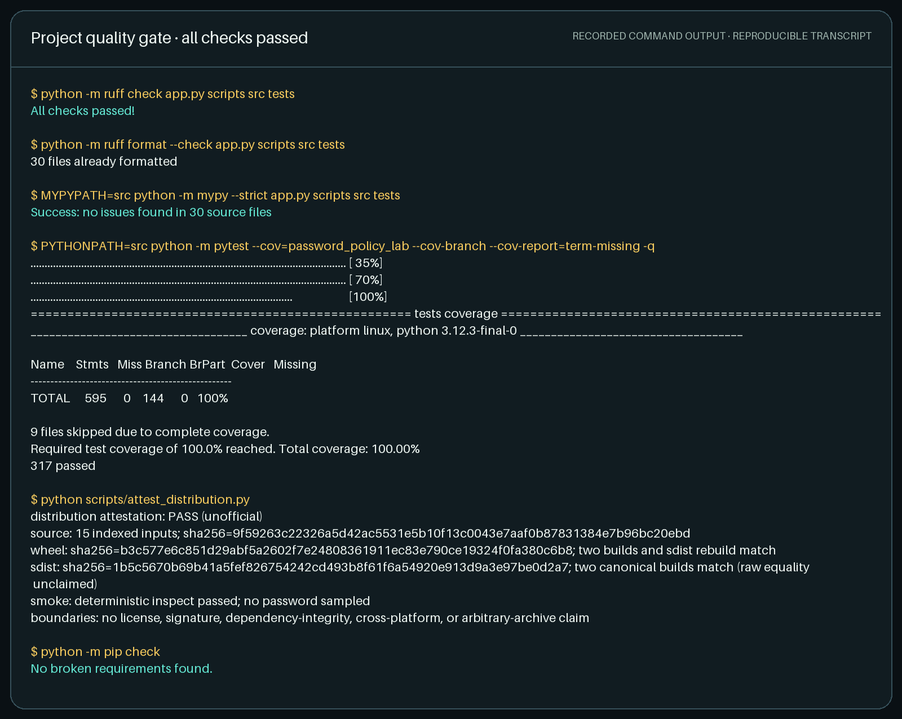

Evidence provenance stays next to the visuals:

- [`manifest.json`](docs/evidence/manifest.json) — source and artifact SHA-256
  digests, dimensions, tool versions, HTTP statuses, DOM assertions, and the
  zero-sampler-call guard result;
- [`web-validation-reference.png`](docs/evidence/web-validation-reference.png)
  — the three lossless, full-resolution browser frames used to independently
  verify every decoded GIF frame;
- [`quality-gate.txt`](docs/evidence/quality-gate.txt) — normalized output from
  the real Ruff, format, mypy, pytest, coverage, and dependency checks;
- [`state-space-sweep.csv`](docs/evidence/state-space-sweep.csv) — exact plot
  input from the public CLI;
- [`cli-inspect.txt`](docs/evidence/cli-inspect.txt) — exact deterministic
  inspection output.

No timestamp or absolute machine path is accepted into the manifest or raw
evidence. `make evidence-check` recomputes hashes and semantic invariants so a
code change cannot silently leave stale portfolio media behind.
